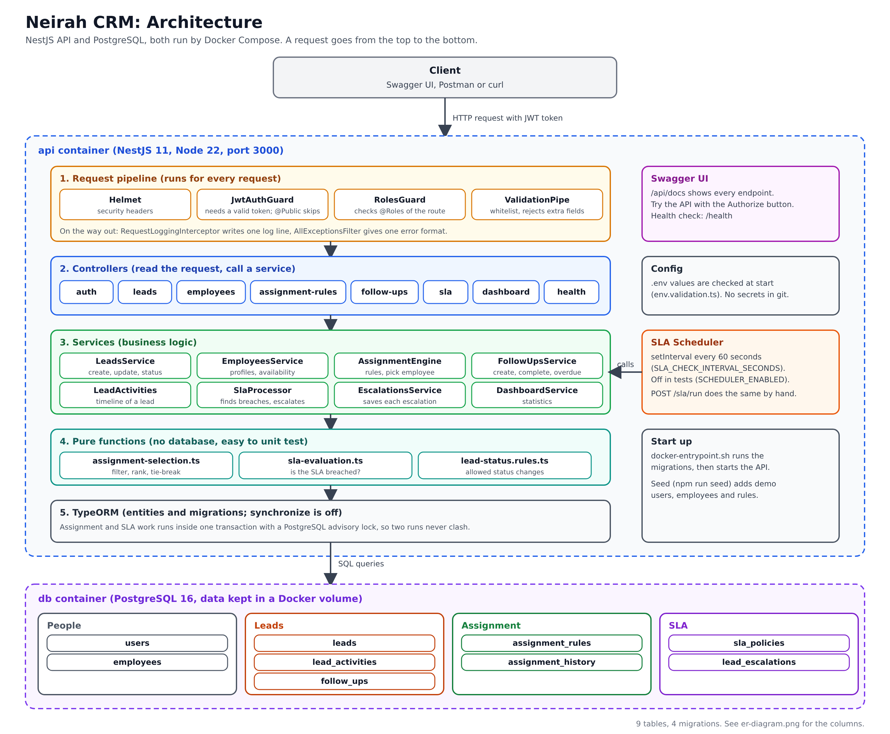
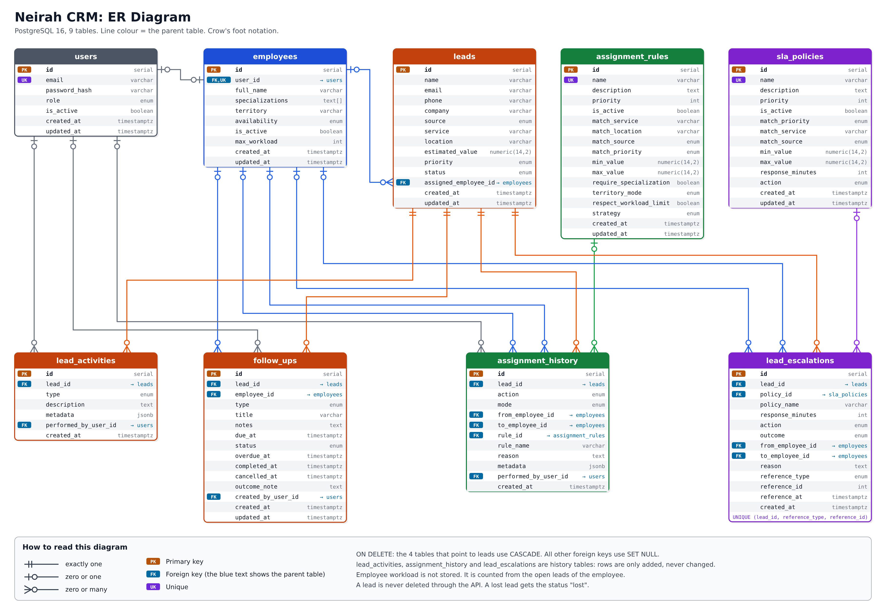

# Neirah CRM: Smart Lead Assignment & Follow-Up Engine

A backend module for a CRM. It stores leads, assigns each lead to a sales employee using rules kept in the
database, tracks follow-ups, and escalates leads that nobody has acted on in time. Every decision is saved,
so you can always see who got a lead, why, and what happened next.

Built for the Neirah Tech Solution internship task with NestJS 11, TypeScript, PostgreSQL 16, TypeORM, Docker and Jest.

This README explains how to run the project. The two diagrams are in the `diagrams` folder.

## What it does

- Leads from website, referral, campaign, social media or manual entry, with search, filters and pagination.
- Sales employee profiles: specialization, territory, availability, maximum workload.
- Assignment engine driven by rules in the database: filters by specialization, territory and availability,
  then ranks by workload. The reason for each decision is stored.
- Manual reassignment, with the full assignment history kept.
- Follow-ups with due dates and automatic overdue marking.
- SLA policies: a lead with no response in time is flagged or moved to another employee, once per breach.
- Activity timeline per lead, and dashboard statistics.
- JWT login with three roles: admin, manager, sales.

## Run it

You need Node.js 20 or newer, npm and Docker.

```bash
git clone https://github.com/GowthamJegatheeswaran/neirah-crm-engine.git
cd neirah-crm-engine
npm install
cp .env.example .env        # set your own DB password and JWT secret
```

**Everything in Docker** (database and API; the API runs the migrations when it starts):

```bash
docker compose up -d --build
npm run seed                # optional demo data
```

**Database in Docker, API on your machine:**

```bash
docker compose up -d db
npm run migration:run
npm run seed
npm run start:dev
```

Then open:
- Swagger UI: http://localhost:3000/api/docs
- Health check: http://localhost:3000/health

Do not run `npm run start:dev` and the Docker API at the same time; both use port 3000.
Without Docker, any PostgreSQL 14+ works if the user and database match your `.env`.

## Configuration

All values are in `.env` (not committed). `.env.example` lists them.

| Variable | Meaning |
|----------|---------|
| `PORT` | API port, default 3000 |
| `DB_HOST`, `DB_PORT`, `DB_USERNAME`, `DB_PASSWORD`, `DB_NAME` | PostgreSQL connection |
| `JWT_SECRET`, `JWT_EXPIRES_IN` | Token secret and lifetime, for example `1h` |
| `SCHEDULER_ENABLED` | `true` by default: the app runs the SLA check by itself. Always off in tests |
| `SLA_CHECK_INTERVAL_SECONDS` | How often the SLA check runs, default 60 |
| `SEED_DEFAULT_PASSWORD` | Password of the demo users (used only by the seed) |

## Demo data and accounts

`npm run seed` loads demo users, employees, rules, SLA policies and a few leads. The data is in
`src/database/seeds/demo-data.ts`, separate from the application code, and the seed refuses to run when
`NODE_ENV=production`. The password for every demo user is `SEED_DEFAULT_PASSWORD`.

| Email | Role |
|-------|------|
| admin@neirah.test | admin |
| manager@neirah.test | manager |
| arun@, priya@, kumar@, divya@, nimal@, sara@neirah.test | sales |

The seed includes one employee on leave, one inactive employee, and a lead nobody can take
(service "Government", location "Galle"), so the "no eligible employee" case can be shown.

## Commands

| Command | What it does |
|---------|--------------|
| `npm run start:dev` | Run the API with reload |
| `npm run build`, `npm run start:prod` | Compile and run |
| `npm run migration:run`, `migration:revert`, `migration:show` | Manage migrations |
| `npm run seed` | Load demo data (safe to repeat) |
| `npm test` | Unit tests (62) |
| `npm run test:e2e` | End-to-end tests (137). Needs the database, migrations and seed |
| `npm run lint` | ESLint |
| `npm run demo` | Narrated check of the whole flow against the running API |
| `npm run time-travel -- lead\|followup <id> <minutes>` | Demo helper: make a lead or follow-up older to show overdue and SLA cases |

## Diagrams

Architecture: how a request moves through the API to the database.



ER diagram: the 9 tables, their columns and how they connect.



## How the code is organised

```
src/
  auth/         login, JWT, guards and role decorators
  users/        user accounts
  employees/    sales employee profiles
  leads/        leads, notes, activity timeline
  assignment/   rules, selection logic, engine, history
  follow-ups/   follow-ups and overdue handling
  sla/          SLA policies, processor, scheduler, escalations
  dashboard/    statistics
  health/       health check
  common/       exception filter, request logging, Swagger setup, pagination
  config/       environment validation
  database/     migrations and demo seed
test/           end-to-end tests
scripts/        demo and time-travel helpers
diagrams/       architecture and ER diagram
```

Each request goes controller, then service, then database. The matching and ranking logic for assignment
and the SLA breach check are plain functions without database access, which keeps them easy to unit test.

## Notes

- The schema changes only through migrations (`synchronize` is off).
- Employee workload is counted from open leads, not stored, so it cannot go out of date.
- History tables are append-only. Leads are never deleted through the API; use status `lost`.
- Running the SLA check repeatedly never repeats an escalation (unique key on lead, reference type and reference id).
