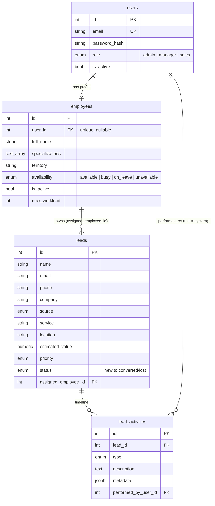

# Neirah CRM - Smart Lead Assignment & Follow-Up Engine

Backend module for a CRM: lead management, configurable smart assignment, follow-ups,
SLA checks and escalation. Built as a 5-day internship task for Neirah Tech Solution.

**Stack:** Node.js 22, NestJS 11, TypeScript, PostgreSQL 16, TypeORM, JWT (Passport), bcrypt, Swagger, Docker, Jest

## Progress

| Day | Scope | Status |
|-----|-------|--------|
| 1 | Project foundation, DB schema + migration, JWT auth, RBAC, seed data | Done |
| 2 | Lead & employee CRUD, search/filter/pagination, notes, activity timeline | Planned |
| 3 | Configurable assignment rules and smart auto-assignment, assignment history | Planned |
| 4 | Follow-ups, overdue/SLA scheduler, escalation, dashboard stats | Planned |
| 5 | Edge-case tests, API docs, Docker for the API, final demo | Planned |

## Quick start

Requirements: Node.js 20+ (22 recommended), npm, Docker (for PostgreSQL).

```bash
git clone <your-repo-url>
cd neirah-crm-engine

npm install
cp .env.example .env          # then edit .env and set your own DB password + JWT secret

docker compose up -d db       # start PostgreSQL 16
npm run migration:run         # create the tables
npm run seed                  # load DEMO data (users, employees, leads)

npm run start:dev             # API on http://localhost:3000
```

- Swagger UI (API docs): http://localhost:3000/api/docs
- Health check: http://localhost:3000/health

> Do not have Docker? Any PostgreSQL 14+ works. Create the user/database that match your `.env`.

## Environment variables

All values live in `.env` (never committed). See `.env.example`. The app validates them on startup and
refuses to boot if something required is missing.

| Variable | Purpose |
|----------|---------|
| `PORT` | API port (default 3000) |
| `DB_HOST`, `DB_PORT`, `DB_USERNAME`, `DB_PASSWORD`, `DB_NAME` | PostgreSQL connection (also used by docker-compose) |
| `JWT_SECRET` | Secret used to sign tokens (use a long random string) |
| `JWT_EXPIRES_IN` | Token lifetime, e.g. `1h` |
| `SEED_DEFAULT_PASSWORD` | Password given to the DEMO seed users only |

## Demo accounts (created by `npm run seed`)

Password for all of them is the value of `SEED_DEFAULT_PASSWORD` in your `.env`.

| Email | Role |
|-------|------|
| admin@neirah.test | admin |
| manager@neirah.test | manager |
| arun@ / priya@ / kumar@ / divya@ / nimal@ / sara@neirah.test | sales |

Demo data lives in `src/database/seeds/demo-data.ts`, separate from real code. It is designed for the
assignment demo: several eligible employees, one on leave, one inactive, and a lead nobody can handle.
The seed refuses to run when `NODE_ENV=production`.

## Scripts

| Command | What it does |
|---------|--------------|
| `npm run start:dev` | Run the API with auto-reload |
| `npm run build` / `npm run start:prod` | Compile and run the compiled app |
| `npm run migration:generate -- src/database/migrations/Name` | Create a migration from entity changes |
| `npm run migration:run` / `migration:revert` / `migration:show` | Apply / undo / list migrations |
| `npm run seed` | Load demo data (idempotent) |
| `npm test` | Unit tests |
| `npm run test:e2e` | End-to-end tests (needs DB + migrations + seed) |
| `npm run lint` | ESLint |

## Day 1 API

| Method & path | Access | Description |
|---------------|--------|-------------|
| `POST /auth/login` | Public | Email + password -> JWT access token |
| `GET /auth/me` | Any logged-in user | Current user from the token |
| `POST /users` | Admin | Create a user |
| `GET /users` | Admin, Manager | List users (never includes password hashes) |
| `GET /health` | Public | API + database status |

Use the token as `Authorization: Bearer <token>`. In Swagger UI click **Authorize** and paste the token.

## Security design

- **Passwords** are hashed with bcrypt (10 rounds). Plain passwords are never stored or logged.
- `password_hash` is `select: false`: it is only loaded by the login query, so it cannot leak into responses.
- **JWT** is checked by a global guard: every route is protected unless marked `@Public()` (secure by default).
- The user is re-loaded from the database on each request, so a deactivated user is blocked immediately.
- **RBAC** with `@Roles(...)` + `RolesGuard`: `401` = not logged in, `403` = logged in but not allowed.
- Login errors use one generic message and equal work for unknown email / wrong password (no user enumeration).
- Request bodies are validated (whitelist + forbid unknown fields). `helmet` sets security headers.
- One exception filter returns consistent JSON errors and never leaks stack traces or SQL.
- Secrets come only from environment variables; `.env` is git-ignored.

## Database schema (Day 1)



Design notes:
- Schema changes happen **only through migrations** (`synchronize` is off).
- Employee **workload is not stored**; it will be counted from open assigned leads, so it can never go stale.
- `lead_activities` is an append-only timeline/audit log.
- Indexes on the columns used by filtering and assignment (`status`, `assigned_employee_id`, `service + location`, ...).
- Assignment rules, assignment history and follow-ups are added in later migrations (Day 3 and Day 4).

## Project structure

```
src/
  auth/        login, JWT strategy, guards (JwtAuthGuard, RolesGuard), decorators
  users/       User entity, UsersService (bcrypt), admin endpoints
  employees/   Employee entity (assignment inputs)
  leads/       Lead + LeadActivity entities and enums
  health/      /health endpoint
  common/      shared pieces (global exception filter)
  config/      environment validation
  database/    TypeORM options, CLI data source, migrations/, seeds/ (demo data)
test/          end-to-end tests
```

Layering rule used throughout: **controller** (HTTP only) -> **service** (business logic) -> **repository/entity** (data access).
