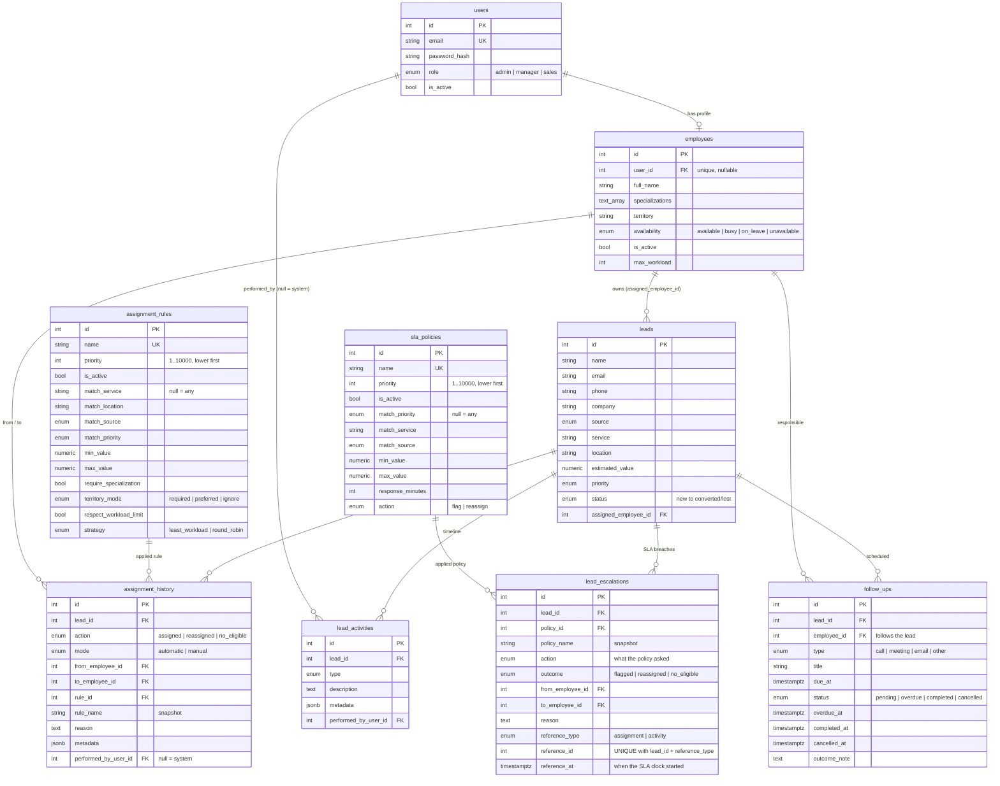

# Neirah CRM - Smart Lead Assignment & Follow-Up Engine

Backend module for a CRM: lead management, configurable smart assignment, follow-ups,
SLA checks and escalation. Built as a 5-day internship task for Neirah Tech Solution.

**Stack:** Node.js 22, NestJS 11, TypeScript, PostgreSQL 16, TypeORM, JWT (Passport), bcrypt, Swagger, Docker, Jest

## Progress

| Day | Scope | Status |
|-----|-------|--------|
| 1 | Project foundation, DB schema + migration, JWT auth, RBAC, seed data | Done |
| 2 | Lead & employee CRUD, search/filter/pagination, notes, activity timeline | Done |
| 3 | Configurable assignment rules and smart auto-assignment, assignment history | Done |
| 4 | Follow-ups, overdue/SLA processing, escalation + reassignment, audit trail, dashboard | Done |
| 5 | Edge-case tests, API docs, Docker for the API, final demo | Planned |

## Quick start

Requirements: Node.js 20+ (22 recommended), npm, Docker (for PostgreSQL).

```bash
git clone <your-repo-url>
cd neirah-crm-engine

npm install
cp .env.example .env          # then edit .env and set your own DB password + JWT secret

docker compose up -d db       # start PostgreSQL 16
npm run migration:run         # create / update the tables
npm run seed                  # load DEMO data (users, employees, leads, assignment rules)

npm run start:dev             # API on http://localhost:3000
```

- Swagger UI (API docs): http://localhost:3000/api/docs
- Health check: http://localhost:3000/health

> Do not have Docker? Any PostgreSQL 14+ works. Create the user/database that match your `.env`.

## Environment variables

All values live in `.env` (never committed). See `.env.example`. The app validates them on startup and
refuses to boot if something required is missing.

| Variable | Purpose |
|----------|---------|
| `PORT` | API port (default 3000) |
| `DB_HOST`, `DB_PORT`, `DB_USERNAME`, `DB_PASSWORD`, `DB_NAME` | PostgreSQL connection (also used by docker-compose) |
| `JWT_SECRET` | Secret used to sign tokens (use a long random string) |
| `JWT_EXPIRES_IN` | Token lifetime, e.g. `1h` |
| `SCHEDULER_ENABLED` | `true` (default) = the app runs the SLA processor by itself. Always off when `NODE_ENV=test` |
| `SLA_CHECK_INTERVAL_SECONDS` | How often the scheduler runs (default 60, min 5) |
| `SEED_DEFAULT_PASSWORD` | Password given to the DEMO seed users only |

## Demo accounts (created by `npm run seed`)

Password for all of them is the value of `SEED_DEFAULT_PASSWORD` in your `.env`.

| Email | Role |
|-------|------|
| admin@neirah.test | admin |
| manager@neirah.test | manager |
| arun@ / priya@ / kumar@ / divya@ / nimal@ / sara@neirah.test | sales |

Demo data lives in `src/database/seeds/demo-data.ts`, separate from real code. It is designed for the
assignment demo: several eligible employees, one on leave, one inactive, and a lead nobody can handle.
The seed refuses to run when `NODE_ENV=production`.

## Scripts

| Command | What it does |
|---------|--------------|
| `npm run start:dev` | Run the API with auto-reload |
| `npm run build` / `npm run start:prod` | Compile and run the compiled app |
| `npm run migration:generate -- src/database/migrations/Name` | Create a migration from entity changes |
| `npm run migration:run` / `migration:revert` / `migration:show` | Apply / undo / list migrations |
| `npm run seed` | Load demo data (idempotent) |
| `npm test` | Unit tests |
| `npm run test:e2e` | End-to-end tests (needs DB + migrations + seed) |
| `npm run lint` | ESLint |

## Day 1 API

| Method & path | Access | Description |
|---------------|--------|-------------|
| `POST /auth/login` | Public | Email + password -> JWT access token |
| `GET /auth/me` | Any logged-in user | Current user from the token |
| `POST /users` | Admin | Create a user |
| `GET /users` | Admin, Manager | List users (never includes password hashes) |
| `GET /health` | Public | API + database status |

Use the token as `Authorization: Bearer <token>`. In Swagger UI click **Authorize** and paste the token.

## Day 2 API

| Method & path | Access | Description |
|---------------|--------|-------------|
| `POST /leads` | Admin, Manager | Create a lead (starts as `new`, logs `lead_created`) |
| `GET /leads` | All (sales: own leads only) | Search, filter, sort, paginate |
| `GET /leads/:id` | All (sales: own leads only) | One lead |
| `PATCH /leads/:id` | All (sales: own leads only) | Edit details and/or move status |
| `POST /leads/:id/notes` | All (sales: own leads only) | Add a note to the timeline |
| `GET /leads/:id/activities` | All (sales: own leads only) | Timeline, oldest first, paginated |
| `POST /employees` | Admin, Manager | Create employee profile (optionally linked to a sales user) |
| `GET /employees` | Admin, Manager | Filter by search/territory/specialization/availability; sort incl. open leads |
| `GET /employees/:id`, `PATCH /employees/:id` | Admin, Manager | Read / update a profile |
| `GET /employees/me`, `PATCH /employees/me/availability` | Sales | Own profile / own availability |

**Lead list query params:** `page`, `limit` (max 100), `search`, `status`, `priority`, `source`, `service`,
`location`, `assignedEmployeeId`, `unassigned`, `minValue`, `maxValue`, `createdFrom`, `createdTo`,
`sortBy` (`createdAt|updatedAt|estimatedValue|name|status|priority`), `order` (`asc|desc`).

**Status lifecycle:** `new -> assigned -> contacted -> qualified -> follow_up -> converted | lost`.
`new` and `assigned` are set by the system (the assignment engine), never manually. `converted` and `lost` are final.
Invalid moves return `409`.

**Design decisions**
- Every change (create, edit, status change, note) writes a row to `lead_activities` in the **same transaction**
  as the change, so the timeline can never disagree with the data. Rows are only ever inserted.
- A sales user asking for someone else's lead gets `404`, not `403`, so lead ids cannot be probed.
- Sort fields are a whitelist mapped to SQL by the server; search text has `%` and `_` escaped.
- Leads are not deleted through the API: history and audit must stay intact. Use status `lost` instead.

## Day 3 API: smart assignment

| Method & path | Access | Description |
|---------------|--------|-------------|
| `POST /assignment-rules` | Admin | Create a rule |
| `PATCH /assignment-rules/:id` | Admin | Edit / activate / deactivate a rule (`null` clears an optional condition) |
| `GET /assignment-rules`, `GET /assignment-rules/:id` | Admin, Manager | List (filter `isActive`) / read |
| `POST /leads/:id/assign` | Admin, Manager | Run the engine for a `new` lead |
| `GET /leads/:id/assignment-preview` | Admin, Manager | Dry run: who would get it and why. Writes nothing |
| `POST /leads/:id/reassign` | Admin, Manager | Manual override: `{ employeeId, reason }` |
| `GET /leads/:id/assignment-history` | All (sales: own leads only) | Every assignment decision, oldest first |

`POST /leads` also auto-assigns the new lead (set `"autoAssign": false` to skip). If the engine fails, the
lead is still created and the response carries the assignment outcome.

**How a lead is assigned**
1. Rules are checked in order of `priority` (lowest number first, then id). The first **active** rule whose
   conditions match wins. A condition left empty means "any": `matchService`, `matchLocation`, `matchSource`,
   `matchPriority`, `minValue`/`maxValue`.
2. **Hard filters** (always applied, in SQL): employee active, availability `available`, linked user active,
   and (if the rule says so) the lead's service is in the employee's specializations.
3. **Rule policy:** skip employees already at `max_workload` (`respectWorkloadLimit`); territory is
   `required` (must match location), `preferred` (matching territory is ranked first) or `ignore`.
4. **Ranking is deterministic**, no randomness:
   - `least_workload`: fewest open leads, then least recently assigned, then lowest id.
   - `round_robin`: least recently assigned, then lowest id.
5. The result is saved with the reason, e.g. `Rule 'X': Priya chosen by lowest workload (2/10 open leads) among 3 eligible`.
   If nobody qualifies the lead stays `new`, a `no_eligible` history row and an `assignment_failed` activity are written.

**Design decisions**
- Rules live in the `assignment_rules` table, so behaviour changes without a deploy. Rules are deactivated, not deleted.
- Matching and ranking are **pure functions** (`assignment-selection.ts`) with unit tests; the engine only does I/O.
- "Least recently assigned" uses the history row id, not timestamps, so ties never depend on clock precision.
- Concurrency: a transaction-scoped advisory lock serialises assignment decisions and the lead row is locked
  with `FOR UPDATE`, so two requests cannot over-fill an employee or assign the same lead twice.
- `assignment_history` is append-only and keeps `rule_name` as a snapshot, so history survives rule edits.
- A manual reassign is allowed even if the chosen employee is on leave or full, but the override is recorded
  in the history metadata as `overrideWarnings`.
- Assignment history and the lead activity row are written in the same transaction as the owner change.

## Day 4 API: follow-ups, SLA and escalation, dashboard

**Follow-ups**

| Method & path | Access | Description |
|---------------|--------|-------------|
| `POST /leads/:id/follow-ups` | All (sales: own leads only) | `{ title, dueAt, type?, notes?, employeeId? }`. `dueAt` must be in the future (422). Owner defaults to the lead owner |
| `GET /leads/:id/follow-ups` | All (sales: own leads only) | Follow-ups of one lead |
| `GET /follow-ups` | All (sales: own follow-ups only) | Filters: `status`, `type`, `employeeId`, `leadId`, `overdue`, `dueFrom`, `dueTo`; paginated, soonest first |
| `GET /follow-ups/:id`, `PATCH /follow-ups/:id` | All (scoped) | Read / edit / reschedule (only while `pending` or `overdue`) |
| `POST /follow-ups/:id/complete`, `POST /follow-ups/:id/cancel` | All (scoped) | `{ note? }`. Final: a second call is `409` |

Follow-up states: `pending -> overdue -> completed | cancelled` (`pending` can also go straight to completed/cancelled).
Every response has `isOverdue`: true for any open follow-up past its due time, even before the processor ran.
- Follow-ups **move with the lead**: any reassignment (manual or SLA) transfers the open ones to the new owner.
- When a lead is **converted or lost**, its open follow-ups are cancelled automatically.

**SLA policies, processor and escalations**

| Method & path | Access | Description |
|---------------|--------|-------------|
| `POST /sla-policies`, `PATCH /sla-policies/:id` | Admin | Create / edit / deactivate a policy |
| `GET /sla-policies`, `GET /sla-policies/:id` | Admin, Manager | List (filter `isActive`) / read |
| `POST /sla/run?dryRun=true` | Admin, Manager | Run the processor now (the scheduler runs the same code). `dryRun` only reports |
| `GET /escalations` | Admin, Manager | Filters: `leadId`, `employeeId`, `policyId`, `outcome`, `from`, `to`; newest first |
| `GET /leads/:id/escalations` | All (sales: own leads only) | Escalation history of one lead |

**How the SLA works**
1. A policy says: leads matching these conditions (`matchPriority`, `matchService`, `matchSource`, `minValue`/`maxValue`;
   empty = any) must get a response within `responseMinutes`, otherwise do `action`: `flag` or `reassign`.
   Like assignment rules: lowest `priority` number first, first active match wins.
2. **The SLA clock** starts at the latest of: the last assignment, or the last *response* on the lead
   (status change, note, follow-up created or completed). A lead with a pending, not-yet-due follow-up counts as covered.
3. Only open leads that have an owner are checked. Breach = the deadline has strictly passed.
4. **Escalation** (one transaction per lead): writes `sla_breached` and `escalated` activities and a `lead_escalations` row.
   With `reassign` the engine picks another eligible employee using the normal assignment rules, **never the current
   owner** (history: action `reassigned`, mode `automatic`, performed by = system). If nobody else is eligible the
   escalation is recorded with outcome `no_eligible` and the owner is kept.
5. The processor also marks late follow-ups `overdue` and writes one `follow_up_overdue` activity each.

**Why running it twice never duplicates anything (idempotency)**
- A breach is identified by the event that started the clock (the *reference*: assignment id or activity id).
  `lead_escalations` has `UNIQUE (lead_id, reference_type, reference_id)`, so the same breach can be stored only once.
  A new assignment or a new response is a new reference, so it opens a fresh SLA window.
- Each lead is processed under the assignment advisory lock + the lead row lock and re-checked before acting.
- A session advisory lock allows one processor run at a time across several app instances; an in-process flag
  stops overlapping timer ticks.
- Overdue marking only touches rows still `pending`.

**Dashboard**

| Method & path | Access | Description |
|---------------|--------|-------------|
| `GET /dashboard/overview` | Admin, Manager | Leads by status/source/priority, unassigned, conversion and win rate, follow-ups (pending, overdue, due today), escalations, assignment stats. Optional `from` / `to` (by creation time) |
| `GET /dashboard/employees` | Admin, Manager | Per employee: open leads, utilisation, converted/lost, pending and overdue follow-ups, SLA breaches. Paginated |
| `GET /dashboard/me` | Sales | Own numbers and the next 5 open follow-ups |

`conversionRate` = converted / all leads; `winRate` = converted / (converted + lost). Both in percent.

**Try it (SLA demo)** - the seed adds three demo policies. Create a lead, then move its history into the past and run the processor:
```bash
# make lead 7 look 2 hours old, then run the processor
psql -h localhost -U crm_user crm_db -c "UPDATE assignment_history SET created_at = now() - interval '2 hours' WHERE lead_id = 7"
curl -s -X POST "http://localhost:3000/sla/run?dryRun=true" -H "Authorization: Bearer $TOKEN"   # preview
curl -s -X POST  http://localhost:3000/sla/run             -H "Authorization: Bearer $TOKEN"   # escalate
curl -s http://localhost:3000/leads/7/activities           -H "Authorization: Bearer $TOKEN"   # read the story
```

**Design decisions**
- SLA policies live in the `sla_policies` table, so thresholds and actions change without a deploy.
- Pure logic (`sla-evaluation.ts`: policy matching, reference clock, breach test) has unit tests; the processor only does I/O.
- The scheduler is a plain `setInterval` (no extra dependency), `unref`'d, disabled under tests; tests call `POST /sla/run` themselves.
- `FollowUpsModule` does not import the leads or assignment modules (they import it), which avoids circular dependencies.
- Lock order is always: assignment lock, then lead row, then follow-up row, so concurrent requests cannot deadlock.
- Follow-up reassignment/cancellation and the activity rows are written in the same transaction as the change.
- Known limit: the processor loads all candidate leads in one query. Fine for this scale; add batching for very large datasets.

## Security design

- **Passwords** are hashed with bcrypt (10 rounds). Plain passwords are never stored or logged.
- `password_hash` is `select: false`: it is only loaded by the login query, so it cannot leak into responses.
- **JWT** is checked by a global guard: every route is protected unless marked `@Public()` (secure by default).
- The user is re-loaded from the database on each request, so a deactivated user is blocked immediately.
- **RBAC** with `@Roles(...)` + `RolesGuard`: `401` = not logged in, `403` = logged in but not allowed.
- Login errors use one generic message and equal work for unknown email / wrong password (no user enumeration).
- Request bodies are validated (whitelist + forbid unknown fields). `helmet` sets security headers.
- One exception filter returns consistent JSON errors and never leaks stack traces or SQL.
- Secrets come only from environment variables; `.env` is git-ignored.

## Database schema (Day 1 + Day 3 + Day 4)



Design notes:
- Schema changes happen **only through migrations** (`synchronize` is off).
- Employee **workload is not stored**; it will be counted from open assigned leads, so it can never go stale.
- `lead_activities` is an append-only timeline/audit log.
- Indexes on the columns used by filtering and assignment (`status`, `assigned_employee_id`, `service + location`, ...).
- `assignment_rules` and `assignment_history` arrived with Day 3; `follow_ups`, `sla_policies` and `lead_escalations` with Day 4.
- `lead_escalations` is append-only, and its unique key is what makes SLA processing idempotent.
- Existing databases: run `npm run migration:run` (and `npm run seed` for the demo SLA policies) after pulling Day 4.

## Project structure

```
src/
  auth/        login, JWT strategy, guards (JwtAuthGuard, RolesGuard), decorators
  users/       User entity, UsersService (bcrypt), admin endpoints
  employees/   Employee entity (assignment inputs)
  leads/       Lead + LeadActivity entities, status rules, lead endpoints
  assignment/  rules API, selection logic (pure), engine, history
  follow-ups/  follow-up entity, API, overdue marking, lead lifecycle hooks
  sla/         SLA policies, pure evaluation, processor, scheduler, escalations
  dashboard/   overview, per-employee and personal statistics (raw SQL)
  health/      /health endpoint
  common/      shared pieces (global exception filter)
  config/      environment validation
  database/    TypeORM options, CLI data source, migrations/, seeds/ (demo data)
test/          end-to-end tests
```

Layering rule used throughout: **controller** (HTTP only) -> **service** (business logic) -> **repository/entity** (data access).
